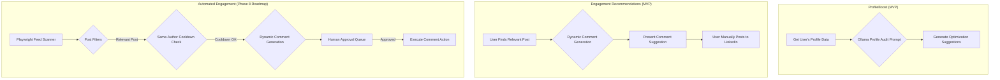

# Feature 2: Profile Foundation & Engagement

This document outlines the two-pronged approach to building a strong foundation for outreach. The MVP focuses on a one-time profile audit (`ProfileBoost`) and human-in-the-loop engagement recommendations. Full automation of feed commenting and likes is deferred to **Phase 8 (Post-MVP)**.

## 1. Architecture Overview

This feature is composed of two sub-systems, with a phased rollout:

1.  **ProfileBoost Audit (MVP)**: A one-time, AI-driven analysis of the user's own LinkedIn profile using the standalone ProfileBoost AI. This ensures the profile is optimized for outreach success before a campaign begins.
2.  **Engagement Recommendations (MVP)**: A human-in-the-loop system that drafts contextual comment suggestions for relevant LinkedIn posts. The user is responsible for finding posts and manually posting the generated comments.
3.  **Automated Feed Engagement (Phase 8)**: The planned post-MVP module that will introduce automation. It will include a feed scanner, post filters, and a dynamic commenter with strict human-approval workflows and safety cooldowns.



## 2. ProfileBoost: One-Time Audit

Before launching outreach, the system performs an audit of the user's own profile. This ensures that when a prospect views the profile, it appears credible, professional, and aligned with the outreach message.

### 2.1. AI Prompt Template for Profile Audit

The prompt is designed to provide actionable, constructive feedback on key areas of the LinkedIn profile.

**Prompt Template (`src/ai/prompts.ts`)**

```typescript
export const generateProfileAuditPrompt = (profileText: string): string => `
You are an expert LinkedIn profile optimization coach. Your task is to analyze a LinkedIn profile and provide specific, actionable recommendations for improvement. Focus on the headline, summary (About section), and recent experience descriptions.

**LinkedIn Profile Text:**
${profileText}

**Instructions:**
1.  **Headline Analysis:** Is the headline clear, concise, and benefit-oriented? Does it contain relevant keywords? Provide a revised, optimized headline.
2.  **Summary Analysis:** Does the summary tell a compelling story? Is it easy to read? Does it have a clear call-to-action? Provide 3-5 concrete suggestions for improvement.
3.  **Experience Analysis:** Are the job descriptions focused on achievements rather than just responsibilities? Do they use quantifiable metrics?
4.  **Overall Score:** Provide an overall score from 1 (needs significant work) to 10 (excellent).
5.  **Output:** Return a JSON object with the structure: { "overallScore": number, "revisedHeadline": string, "summaryFeedback": string[], "experienceFeedback": string[] }.

**JSON Output:**
`;
```

**Testing Gate:** The output is validated to be parsable JSON and checked for the presence of all required keys.

## 3. MVP: Engagement Recommendations

The MVP scope focuses on a human-in-the-loop workflow to help users write engaging comments, leveraging AI for drafting assistance. The user retains full control over finding relevant posts and the final content that gets posted. This approach ensures authenticity and avoids any automated, on-behalf-of actions in the initial release.

The core of this feature is the Dynamic Comment Generation logic.

### 3.1. Dynamic Comment Generation

When a user identifies a relevant post, a targeted AI call generates a contextual and insightful comment suggestion.

**Prompt Template (`src/ai/prompts.ts`)**

```typescript
export const generateCommentPrompt = (postContent: string, authorName: string): string => `
You are a thoughtful industry professional. Your goal is to write a short, insightful, and engaging comment on a LinkedIn post.

**Author:** ${authorName}
**Post Content:**
${postContent}

**Instructions:**
1.  Read the post content carefully to understand its main point.
2.  Write a comment that adds value. Ask a question, share a related insight, or agree with a specific point and expand on it.
3.  Keep the comment concise (1-3 sentences).
4.  Do NOT use generic phrases like "Great post!" or "Thanks for sharing."
5.  Do NOT include hashtags.
6.  Return only the raw text of the comment.

**Comment:**
`;
```

**Testing Gate:** Generated comments are checked against a list of "stop words" and generic phrases to ensure quality. Length constraints are also enforced. The final output is then presented to the user for review and manual posting.

## 4. Phase 8 (Post-MVP): Automated Engagement Engine

The post-MVP roadmap includes the development of an advanced automated engagement module. This system is designed with safety and human oversight as core principles, and will not be implemented without them.

### 4.1. Feed Scanner and Post Filters

The engine will use a Playwright-based feed scanner to identify potentially relevant posts.

**Key Logic (`src/automation/feedScanner.ts`)**

*   **Feed Scanner**: Logs into a persistent browser context, navigates to the feed, and scrolls, processing posts as they appear. It uses a `Set` to track processed post URNs to avoid duplicates.
*   **Post Filters**: Filters posts based on keywords relevant to the user's industry and target audience. Irrelevant posts (e.g., personal life events, politics) are skipped.
*   **Safety Cooldowns**: Implements a strict "same-author cooldown" to avoid engaging with multiple posts from the same person in a short period (e.g., 24 hours). This is managed via a dedicated database table.

### 4.2. Drizzle Schema for Human-Approved Actions

Generated comments are not posted immediately. They are stored in a database table awaiting **strict human approval**. Only actions explicitly approved by the user will be executed.

**Drizzle Schema (`src/db/schema.ts`)**

```typescript
import { pgTable, serial, text, varchar, integer, timestamp, pgEnum } from 'drizzle-orm/pg-core';

export const approvalStatusEnum = pgEnum('approval_status', ['pending', 'approved', 'rejected']);

export const engagementActions = pgTable('engagement_actions', {
  id: serial('id').primaryKey(),
  postUrl: varchar('post_url', { length: 256 }).notNull(),
  postContentSnippet: text('post_content_snippet'),
  authorName: varchar('author_name', { length: 128 }),
  generatedComment: text('generated_comment').notNull(),
  status: approvalStatusEnum('status').default('pending').notNull(),
  approvedAt: timestamp('approved_at'),
  executedAt: timestamp('executed_at'),
  createdAt: timestamp('created_at').defaultNow().notNull(),
});
```
