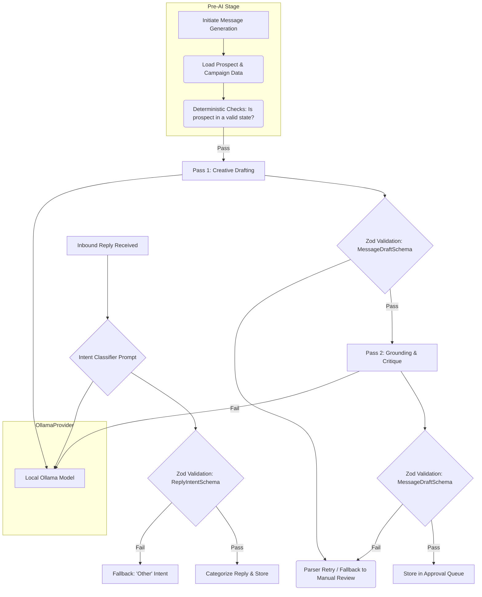

# Feature 3: AI Messaging and Copywriting

This document specifies the architecture of the AI-driven copywriting engine. The system is designed for reliability and quality through a combination of a decoupled AI provider, strict schema validation on all LLM interactions, and a robust operational flow that prioritizes deterministic checks before engaging AI.

## 1. Architecture: Deterministic-First, Validated AI

The system's philosophy is to use deterministic, low-cost checks to pre-filter and prepare data *before* making more expensive and non-deterministic LLM calls. Every single output from the LLM is then strictly validated against a Zod schema before it is stored or used.



## 2. Strict Schema Validation with Zod

To ensure reliability, **all** communication with the LLM is treated as untrusted and is validated against a strict Zod schema. This applies to generating message copy, scoring ICP fit, and classifying replies.

### Core Zod Schemas (`src/schemas/ai.ts`)

```typescript
import { z } from 'zod';

// Validates the output of the AI copywriting prompts
export const MessageDraftSchema = z.object({
  personalizedHook: z.string().min(10).max(150),
  body: z.string().min(20).max(280),
  callToAction: z.string().min(5).max(50),
  fullMessageText: z.string().min(30).max(300), // LinkedIn connection request limit
});

// Validates the output of the reply classification prompt
export const ReplyIntentSchema = z.object({
  intent: z.enum([
    "Positive Inquiry",
    "Objection",
    "Not Interested",
    "Unsubscribe Request",
    "Question",
    "Other"
  ]),
  confidence: z.number().min(0.0).max(1.0),
  summary: z.string(),
});

// (IcpScoreSchema is defined in 01_TARGET_AUDIENCE_AND_ICP.md)
```

### 3. Operational Flow for AI Interaction

The system includes robust procedures for handling the inherent non-determinism of LLMs.

1.  **Deterministic Filtering First**: As detailed in the ICP pipeline, expensive AI evaluations are only performed *after* cheaper, deterministic filters (geography, title, etc.) have been applied.
2.  **Parser Retries**: If the LLM output fails Zod validation (e.g., malformed JSON, missing fields), the system will automatically retry the request up to a configured limit (e.g., 2 times). The prompt for the retry may include additional instructions clarifying the required format.
3.  **Timeout Handling**: All calls to the Ollama provider have a strict timeout (e.g., 45 seconds). If a request times out, it is treated as a failure and enters the retry loop.
4.  **Fallback to Manual Review**: If an AI operation (e.g., message generation) fails after all retries and timeouts, the corresponding `OutreachAction` is moved to a `FAILED` state with a reason code (e.g., `AI_GENERATION_FAILED`). This surfaces the task in a manual review queue in the UI for human intervention.

## 4. Two-Pass Copy Generation Pipeline

To improve quality, we use a two-pass pipeline where the second pass acts as a critic and refiner for the first.

### 4.1. Pass 1: Creative Drafting

The first pass is focused on creativity and personalization, generating an initial draft based on the prospect's profile and the campaign's value proposition.

### 4.2. Pass 2: Grounding, Critique, and Refinement

The draft from Pass 1 is fed into a second, more analytical prompt. This "critique" pass enforces constraints and improves the draft based on a set of rules. The output of this pass must also validate against the `MessageDraftSchema`.

**Prompt Template (`src/ai/prompts.ts`)**

```typescript
export const refineMessagePrompt = (draftMessage: string, prospectInfo: string): string => `
You are a meticulous editor and compliance officer. Your task is to review and refine a draft LinkedIn message to ensure it meets all quality and safety standards.

**Prospect Information:**
${prospectInfo}

**Draft Message:**
"${draftMessage}"

**Critique & Refine Instructions:**
1.  **Grounding Check:** Is the personalization based on specific, verifiable information from the prospect's profile? If not, remove the ungrounded statement.
2.  **Length Enforcement:** The final message must be under 300 characters. If it is longer, shorten it while preserving the core idea.
3.  **Clarity and Tone:** Is the message clear, respectful, and conversational? Remove any jargon or overly aggressive sales language.
4.  **Final Output:** Provide a JSON object that satisfies the following Zod schema:
    \`\`\`json
    {
      "personalizedHook": "string (10-150 chars)",
      "body": "string (20-280 chars)",
      "callToAction": "string (5-50 chars)",
      "fullMessageText": "string (30-300 chars)"
    }
    \`\`\`
5.  Ensure 'fullMessageText' is the complete, ready-to-send message.

**JSON Output:**
`;
```
This structured, validation-centric approach ensures that only high-quality, compliant, and correctly formatted messages are ever placed into the human approval queue.
