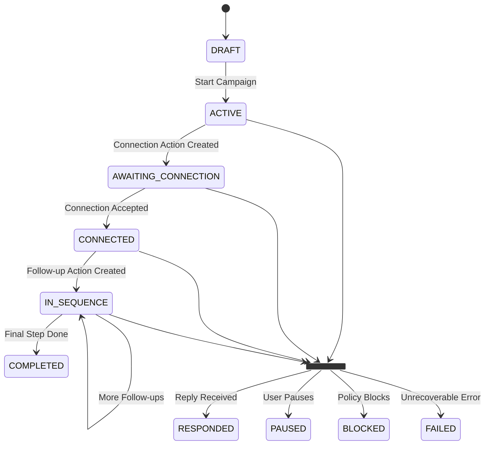
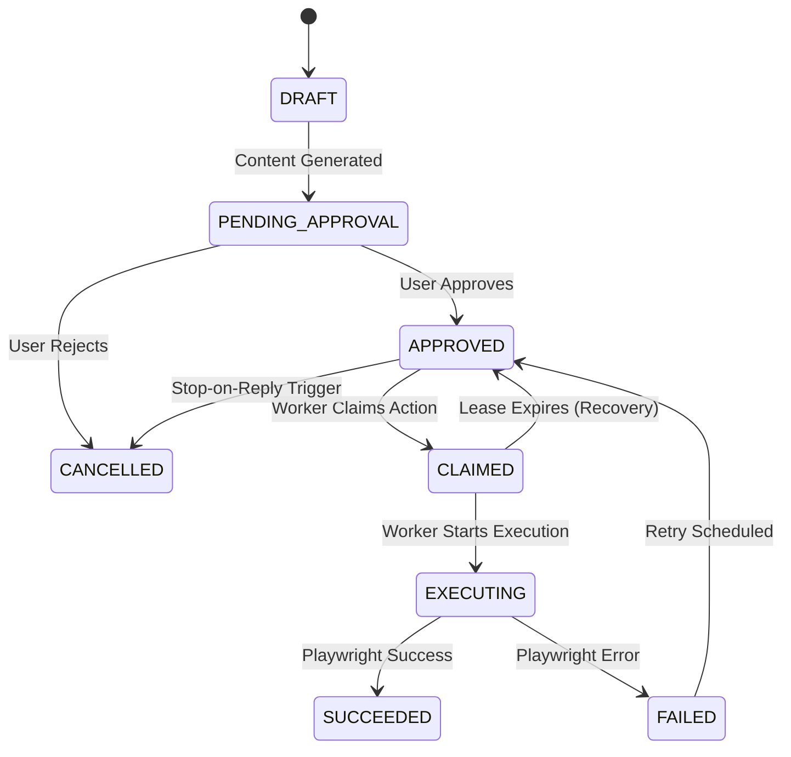

# Feature 4: Outreach Strategy and Sequencing

This document details the core logic of the outreach system: a set of decoupled state machines that manage the lifecycle of each campaign member and the execution of individual outreach actions. This separation is critical for reliability, error handling, and concurrency.

## 1. Architecture: Decoupled State Machines

The system uses two distinct state machines to manage outreach:

1.  **`CampaignMember` State**: A high-level lifecycle state machine. It tracks a prospect's overall journey through a campaign (e.g., from `DRAFT` to `CONNECTED` to `COMPLETED`). It is not concerned with the execution details of specific actions.
2.  **`OutreachAction` State**: A low-level execution state machine. It manages the lifecycle of a single, concrete task (e.g., sending a connection request). It handles scheduling, approval, claiming, locking, execution, and retries.

This decoupling ensures that a failure in executing one action (e.g., a temporary network error) does not corrupt the overall lifecycle state of the campaign member. The action can be retried or failed gracefully while the member's state remains valid.

---

## 2. `CampaignMember` Lifecycle State

This state machine represents the prospect's journey.

**Drizzle Schema (`src/db/schema.ts`)**

```typescript
export const campaignMemberStatusEnum = pgEnum('campaign_member_status', [
  'DRAFT',              // Enrolled, but not yet active in the sequence.
  'ACTIVE',             // Actively progressing through the sequence.
  'AWAITING_CONNECTION',// Connection request has been sent.
  'CONNECTED',          // Connection request was accepted.
  'IN_SEQUENCE',        // Follow-up messages are being sent.
  'RESPONDED',          // Prospect has replied, sequence is stopped.
  'COMPLETED',          // All sequence steps finished successfully.
  'PAUSED',             // Manually paused by a user.
  'BLOCKED',            // Blocked by a global safety policy (e.g., do-not-contact).
  'FAILED',             // An unrecoverable error occurred.
]);

export const campaignMembers = pgTable('campaign_members', {
  // ... IDs and foreign keys
  status: campaignMemberStatusEnum('status').default('DRAFT').notNull(),
  // ... other metadata
});
```

### `CampaignMember` State Diagram



---

## 3. `OutreachAction` Execution State

This state machine manages the transactional lifecycle of a single task.

**Drizzle Schema (`src/db/schema.ts`)**

```typescript
export const outreachActionStatusEnum = pgEnum('outreach_action_status', [
  'DRAFT',              // AI content is being generated.
  'PENDING_APPROVAL',   // Awaiting human sign-off.
  'APPROVED',           // Approved, ready for the scheduler to pick up.
  'CLAIMED',            // A worker has locked this action for execution.
  'EXECUTING',          // Playwright is actively running this task.
  'SUCCEEDED',          // The action was completed successfully.
  'FAILED',             // The action failed (retries may be possible).
  'CANCELLED',          // Cancelled before execution (e.g., due to a reply).
]);

export const outreachActions = pgTable('outreach_actions', {
  // ... IDs and foreign keys
  status: outreachActionStatusEnum('status').default('DRAFT').notNull(),
  idempotencyKey: varchar('idempotency_key', { length: 256 }).notNull().unique(),
  dueAt: timestamp('due_at'),
  leaseExpiresAt: timestamp('lease_expires_at'),
  retryCount: integer('retry_count').default(0),
  // ... other metadata like action type and content
});
```

### `OutreachAction` State Diagram



## 4. Production-Hardened Stop-on-Reply Engine

The stop-on-reply mechanism is critical and built with transactional safety.

1.  **Inbox Sync**: A background worker syncs the LinkedIn inbox, storing new messages in the `inbound_messages` table.
2.  **Transactional State Update**: When a new message from a prospect is detected, a transaction is started:
    *   The corresponding `CampaignMember` is moved to the `RESPONDED` state.
    *   **Crucially**, all future `OutreachAction` records for that member with a status of `APPROVED` are transactionally updated to `CANCELLED`.
3.  **Per-Prospect Lock**: The transaction acquires a row-level lock on the `CampaignMember` record to prevent race conditions with other services that might be trying to create new actions.
4.  **Pre-Send Check**: As a final safeguard, before the `OutreachAction` executor sends a message, it performs a final check on the `CampaignMember`'s status. If the status is no longer `ACTIVE` or `IN_SEQUENCE`, it aborts the action, even if its own status is `APPROVED`. This closes any minuscule race condition windows.

## 5. Phasing Note

*   **MVP**: The core sequence is a connection request followed by up to two messages.
*   **Phase 8**: More complex social engagement actions, such as automated feed commenting or post liking, are deferred to a much later phase. The core outreach engine must be stabilized first, as these actions carry a higher risk profile.
